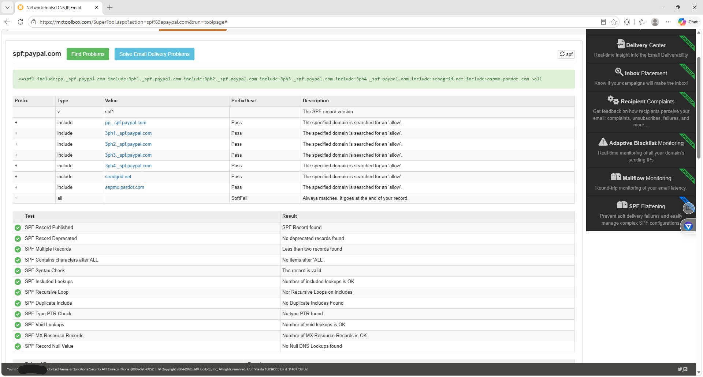
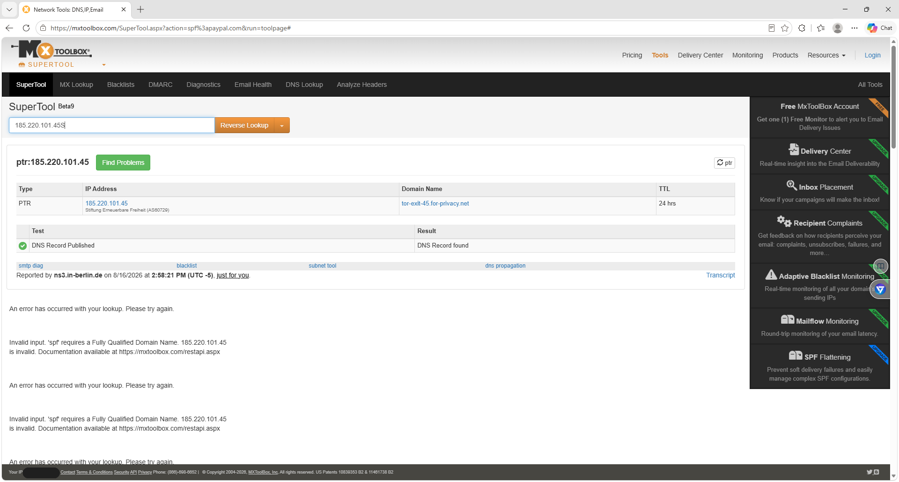
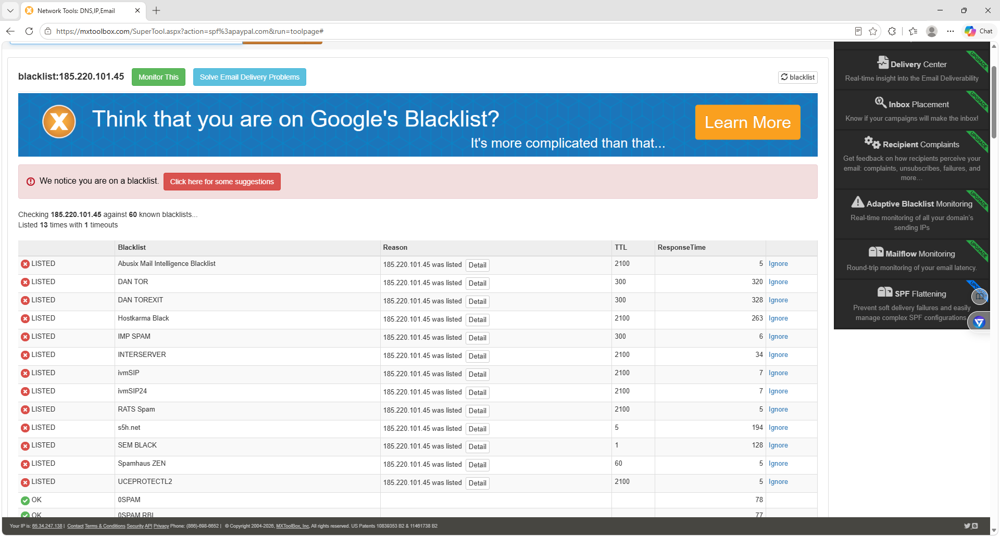
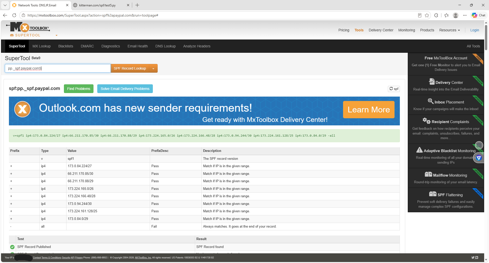
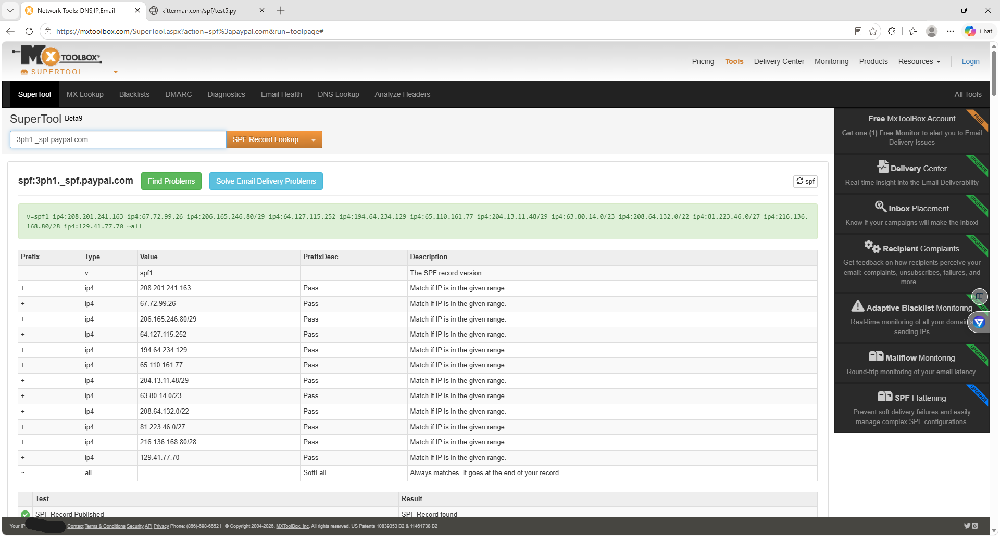
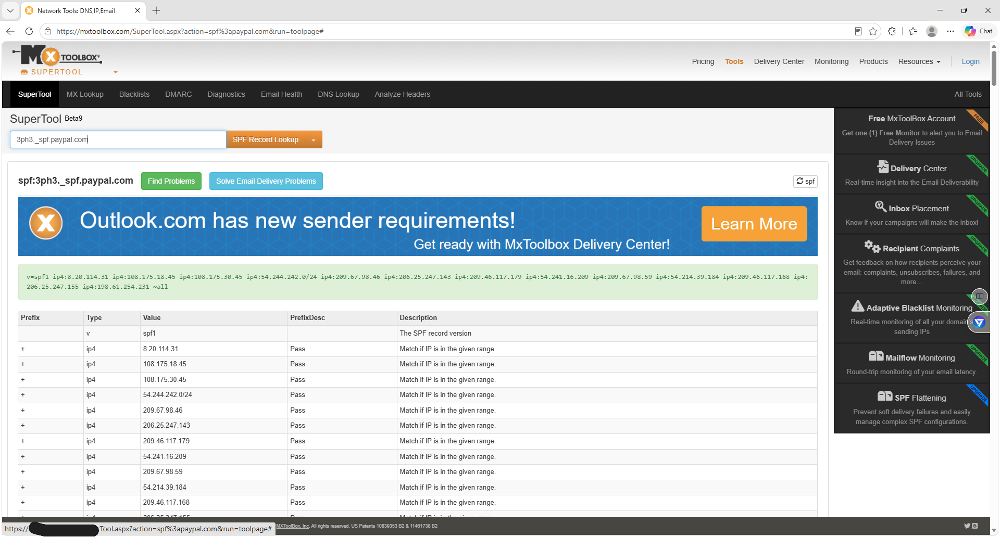
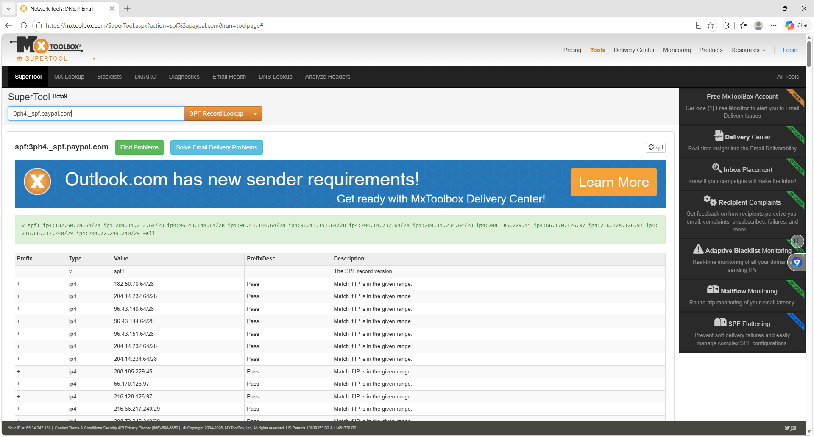
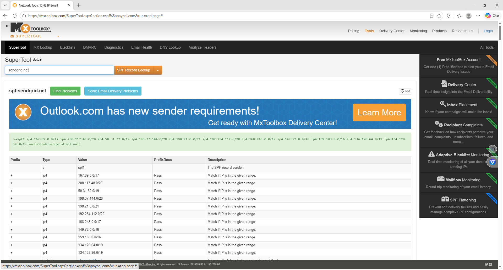
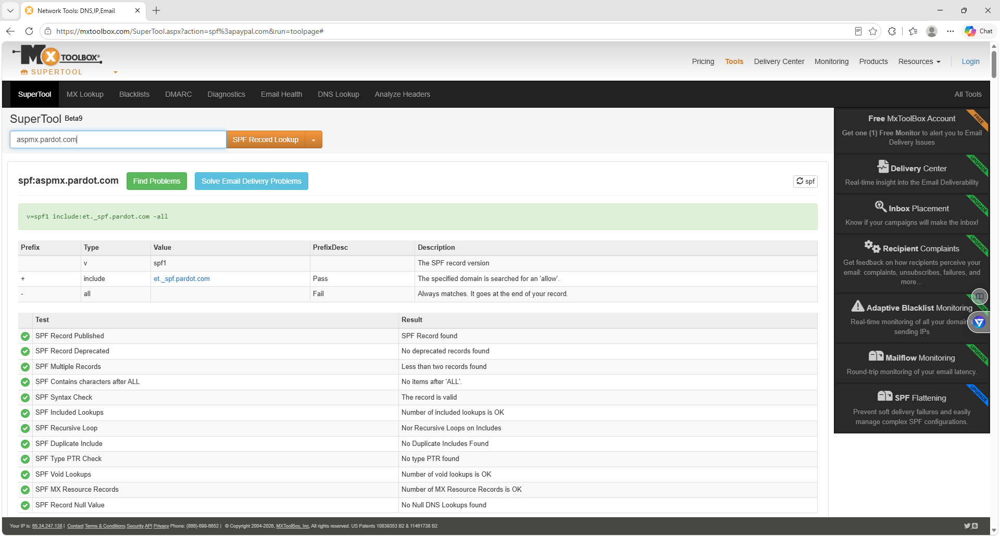

# Darwin SPF Email Authentication SOC Investigation

## Overview

This project documents a simulated Security Operations Center (SOC) investigation of a suspicious email claiming to originate from PayPal.

The investigation focused on SPF authentication, DNS analysis, reverse DNS lookups, IP reputation, blacklist analysis, and validation of authorized email-sending infrastructure.

The suspicious source IP was compared against SPF records associated with `paypal.com`, SendGrid, and Pardot to determine whether the source IP was authorized to send email on behalf of the claimed domain.

---

## Investigation Scenario

- **Claimed Sender:** `security@paypal.com`
- **Claimed Domain:** `paypal.com`
- **Source IP:** `185.220.101.45`
- **Alert Type:** Suspicious Email
- **Investigation Type:** Phishing / Email Authentication
- **Analyst Role:** Tier 1 SOC Analyst

---

## Environment

- MXToolbox SuperTool
- SPF Record Lookup
- DNS / TXT Records
- Reverse DNS / PTR Lookup
- IP Blacklist Lookup
- CIDR / IP Range Analysis
- Web Browser

---

## Skills Demonstrated

- SOC Alert Triage
- Phishing Investigation
- Email Security Analysis
- SPF Authentication Analysis
- DNS Investigation
- Reverse DNS Analysis
- IP Reputation Analysis
- IOC Analysis
- Email Spoofing Detection
- Threat Intelligence
- Incident Documentation

---

## Investigation Evidence

### 1. PayPal SPF Record Lookup

The SPF record for `paypal.com` was retrieved using MXToolbox to identify authorized email-sending infrastructure.

The SPF record contained multiple `include` mechanisms referencing PayPal and third-party email infrastructure.

```text
include:pp._spf.paypal.com
include:3ph1._spf.paypal.com
include:3ph2._spf.paypal.com
include:3ph3._spf.paypal.com
include:3ph4._spf.paypal.com
include:sendgrid.net
include:aspmx.pardot.com
~all
```

The record ends with `~all`, indicating a SoftFail policy when a sending IP does not match an authorized SPF mechanism.



---

### 2. Suspicious IP Reverse DNS Lookup

A reverse DNS lookup was performed against the suspicious source IP:

```text
185.220.101.45
```

The PTR lookup returned:

```text
tor-exit-45.for-privacy.net
```

The hostname indicates that the IP is associated with Tor exit infrastructure.

Tor usage alone does not prove malicious activity, but it increases the risk of an email claiming to originate from a trusted financial organization.



---

### 3. Suspicious IP Blacklist Reputation

The suspicious source IP was checked against multiple IP reputation and blacklist services using MXToolbox.

Notable listings included:

- DAN TOR
- DAN TOREXIT
- Spamhaus ZEN
- RATS Spam
- IMP SPAM
- Hostkarma Black
- Abusix Mail Intelligence Blacklist

The blacklist results provided additional evidence that the source IP should be treated as suspicious.



---

### 4. PayPal SPF Include Investigation

The SPF include record below was investigated:

```text
pp._spf.paypal.com
```

The record contained authorized PayPal email infrastructure, including multiple IPv4 networks.

The suspicious source IP `185.220.101.45` did not match the reviewed PayPal-authorized ranges.



---

### 5. PayPal 3PH1 SPF IP Ranges

The following PayPal SPF record was analyzed:

```text
3ph1._spf.paypal.com
```

The suspicious source IP `185.220.101.45` did not match the reviewed IP addresses or authorized networks contained in the SPF record.



---

### 6. PayPal 3PH2 SPF IP Ranges

The following SPF record was reviewed:

```text
3ph2._spf.paypal.com
```

The suspicious source IP `185.220.101.45` did not match the reviewed PayPal-authorized email infrastructure.


---

### 7. PayPal 3PH3 SPF IP Ranges

The following SPF record was investigated:

```text
3ph3._spf.paypal.com
```

The suspicious source IP `185.220.101.45` did not match the reviewed authorized IP ranges.



---

### 8. PayPal 3PH4 SPF IP Ranges

The following SPF record was investigated:

```text
3ph4._spf.paypal.com
```

The suspicious source IP `185.220.101.45` did not match the reviewed authorized infrastructure.



---

### 9. SendGrid SPF Authorized IP Ranges

The main PayPal SPF record contained the following include:

```text
include:sendgrid.net
```

The SendGrid SPF infrastructure was analyzed to determine whether the suspicious source IP belonged to an authorized SendGrid network.

The source IP `185.220.101.45` did not match the reviewed SendGrid-authorized ranges.



---

### 10. Pardot SPF Include Record

The PayPal SPF record contained the following Pardot include:

```text
include:aspmx.pardot.com
```

Further analysis showed that the Pardot SPF record referenced:

```text
include:et._spf.pardot.com
```

This required an additional SPF lookup to review the underlying authorized infrastructure.



---

### 11. Pardot Authorized SPF IP Ranges

The following SPF record was investigated:

```text
et._spf.pardot.com
```

Authorized networks included:

```text
198.245.81.0/24
136.147.176.0/24
13.111.0.0/16
136.147.182.0/24
136.147.135.0/24
199.122.123.0/24
```

The suspicious source IP `185.220.101.45` did not match the reviewed Pardot-authorized infrastructure.


---

## Indicators of Compromise

| Indicator | Type | Finding |
|---|---|---|
| `185.220.101.45` | IPv4 Address | Suspicious source IP |
| `tor-exit-45.for-privacy.net` | PTR Record | Tor exit infrastructure |
| `security@paypal.com` | Claimed Sender | Possible spoofed identity |
| `paypal.com` | Claimed Domain | PayPal impersonation |
| Multiple blacklist listings | IP Reputation | Elevated risk |

---

## Investigation Findings

The investigation identified multiple suspicious indicators:

- The source IP was associated with Tor exit infrastructure.
- The source IP appeared on multiple blacklist services.
- The source IP did not match the reviewed PayPal SPF infrastructure.
- The source IP did not match the reviewed PayPal third-party SPF records.
- The source IP did not match the reviewed SendGrid infrastructure.
- The source IP did not match the reviewed Pardot infrastructure.
- The claimed sender identity was inconsistent with the reviewed authorized sending infrastructure.

---

## SOC Analyst Verdict

**Classification:** Likely Phishing / Email Spoofing

**Severity:** High

**Confidence:** High

The simulated email should be treated as suspicious because the source IP was inconsistent with the reviewed SPF-authorized infrastructure for the claimed sender domain.

The Tor exit-node association and multiple blacklist listings provided additional supporting indicators.

---

## Recommended Response Actions

- Quarantine the suspicious email.
- Search the SIEM for additional activity involving `185.220.101.45`.
- Identify other users who received similar messages.
- Review complete email headers for SPF, DKIM, and DMARC results.
- Extract and investigate URLs, domains, and attachments.
- Search DNS, proxy, endpoint, and email-security telemetry.
- Block or monitor confirmed malicious indicators according to organizational policy.
- Document findings in the incident management system.
- Escalate if additional evidence of compromise is discovered.

---

## MITRE ATT&CK Mapping

### T1566 - Phishing

Adversaries may use phishing emails to gain initial access or convince users to interact with malicious links, attachments, or other content.

### T1036 - Masquerading

Adversaries may impersonate trusted organizations, services, or users to make malicious activity appear legitimate.

---

## Key Takeaways

This investigation demonstrated how a Tier 1 SOC analyst can analyze suspicious email activity by combining SPF authentication analysis with DNS and threat intelligence.

The lab demonstrated practical experience with:

- SPF authentication
- DNS investigation
- Reverse DNS analysis
- IP reputation analysis
- IOC enrichment
- Phishing investigation
- Email spoofing detection
- Evidence correlation
- Incident classification
- SOC documentation

SPF should not be evaluated by itself. A full email investigation should also review DKIM, DMARC, email headers, URLs, attachments, and available SIEM or endpoint telemetry.

---

## Disclaimer

This project is a simulated cybersecurity investigation created for educational and portfolio purposes.

The suspicious email scenario was created for defensive-security training and does not represent an actual security incident involving PayPal, SendGrid, Pardot, or any other referenced organization.

---

## Author

Darwin Brown Jr.

SOC Analyst | Cybersecurity Analyst
